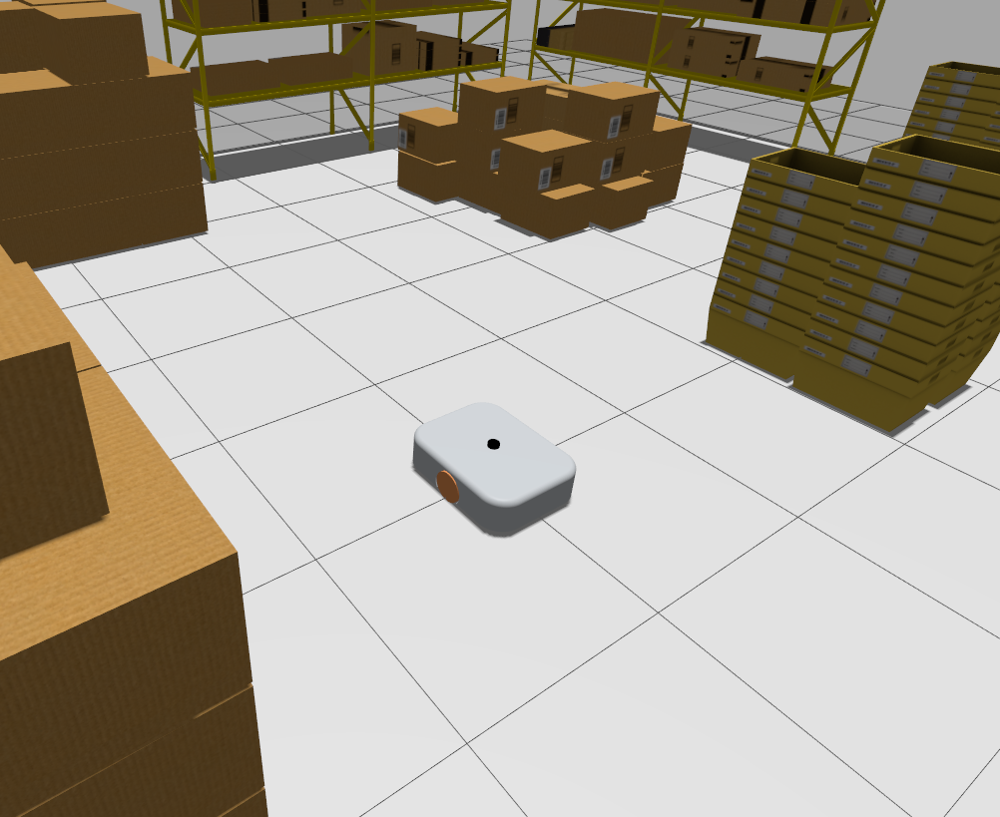

# Two-Wheeled Robot (TWR)

  

A flexible platform for testing and verifying control and navigation algorithms in a simulated environment.

The project is based on a robot with a differential drive on the [ROS 2](https://www.ros.org/) framework.

  
  

> [!IMPORTANT] 
> **Getting Started** guide and **Documentation** are available here:
> 

>  <a href="https://ajedancov.github.io/twr/">
>    
>  </a>
> 

## License
This project is licensed under the terms of the [MIT](./LICENSE.md) license.