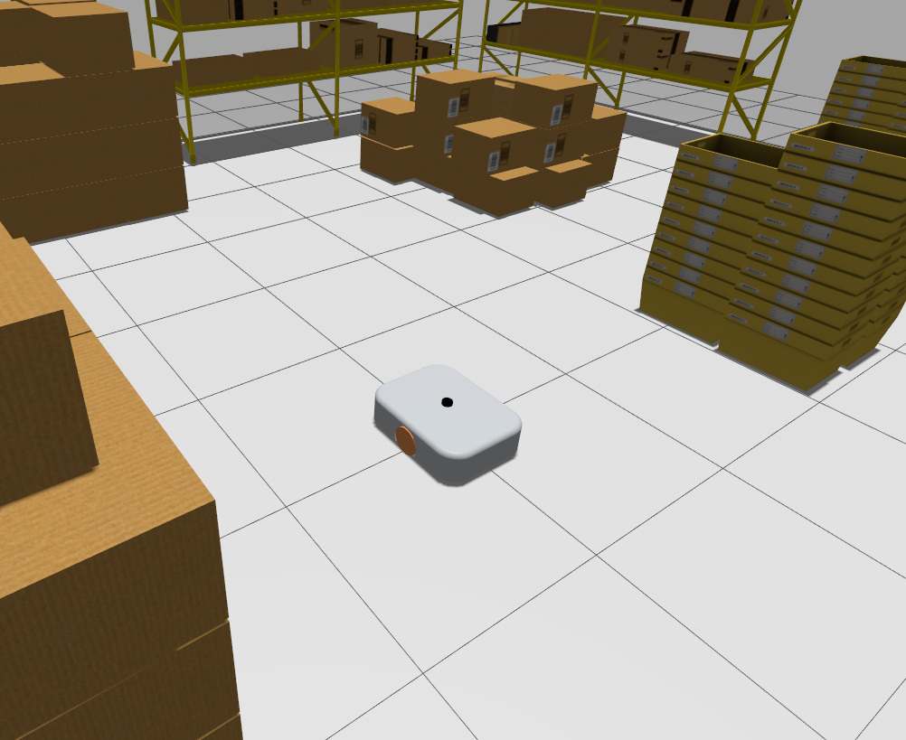
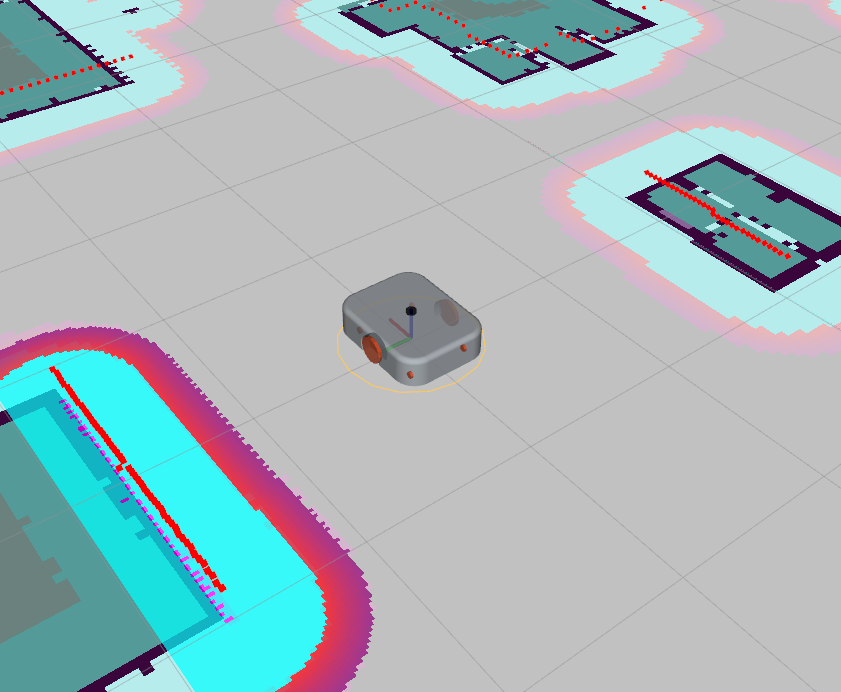
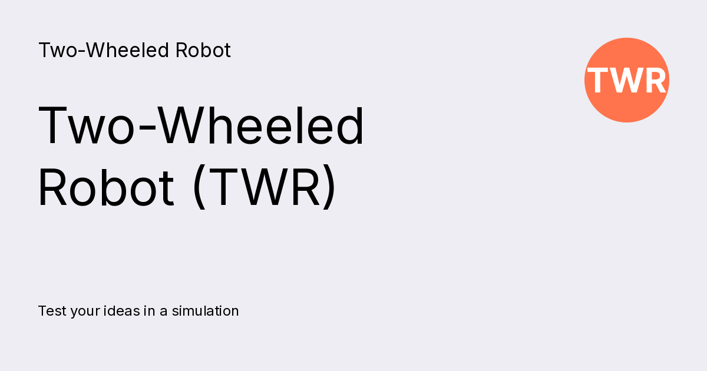

# Two-Wheeled Robot (TWR)


<div align="center">
  
</div>

Ready-to-run simulation environment featuring a differential drive robot powered by [ROS 2](https://www.ros.org/) and integrated with:

- [nav2](https://github.com/ros-navigation/navigation2)
- [slam_toolbox](https://github.com/SteveMacenski/slam_toolbox)
- [ros2_control](https://github.com/ros-controls/ros2_control)
- [robot_localization](https://github.com/cra-ros-pkg/robot_localization)

Perfect for anyone developing mobile robots who needs a quick, flexible, and easy-to-use environment to test control and navigation algorithms.

<div align="center">
  
  
</div>

## Prerequisites

| **Software**       | **Version**  |
|--------------------|--------------|
| Linux Distro       | Ubuntu 24.04 |
| ROS 2 Distro       | Jazzy        |
| Gazebo Sim         | Harmonic     |

## Quick Start

One-command setup to get the simulation environment up and running:

```shell
git clone https://github.com/AJedancov/twr.git && cd twr
chmod +x ./scripts/setup_and_launch.sh
./scripts/setup_and_launch.sh
```

<details><summary> Script summary </summary>

This script will:
1. Install necessary dependencies using rosdep.
2. Build the project.
3. Source the setup file.
4. Launch the TWR simulation environment in Gazebo simulation.

[View full script](./scripts/setup_and_launch.sh)

</details>

Follow [TWR Documentation](https://ajedancov.github.io/twr/) to get started.

<div align="left">
  <a href="https://ajedancov.github.io/twr/">
    
  </a>
</div>

## License

This project is licensed under the terms of the [MIT](./LICENSE.md) license.
