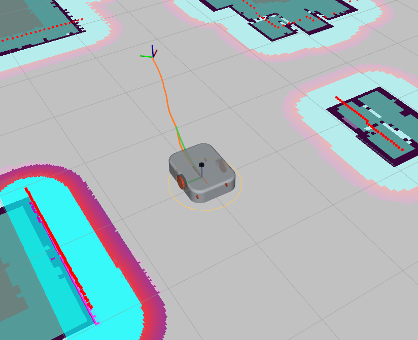

# TWR Project
The objective of this project is to design and implement a modular and flexible platform for testing, validating, and benchmarking a wide range of control and navigation algorithms in a simulated environment.  
The project is based on a model of a robot with a differential drive and is built on the ROS2 framework.

## Available sensors
  ### LIDAR
  **Topic name:** `/scan`  
  **Number of samples:** 360  
  **Range [m]:** 0.05 - 5  
  **Config:** [gz.xacro](./twr_description/urdf/gz.xacro)

  > **Tip**  
  > To visualize LIDAR data in Gazebo, you need to activate the plugin `Visualize Lidar` and refresh list of topics.

  <!-- ### Camera -->
 

<!-- ======================= -->
<!-- === Getting Started === -->
<!-- ======================= -->

## Getting Started

  ### Installation
  Open the directory where the project will be locatedand and clone repository:
  ```shell
  git clone https://github.com/AJedancov/twr.git && 
  cd twr
  ```
  The project allows to build and launch a project on a [local machine](#local-machine), as well as in a [Docker container](#docker).


  ### Local machine
  #### Prerequisites

  **Ubuntu**: 24.04  
  **ROS2 Distro**: Jazzy  
  **Gazebo**: Harmonic

  The project uses following packages:  
  - [Nav2](https://github.com/ros-navigation/navigation2)
  - [slam_toolbox](https://github.com/SteveMacenski/slam_toolbox)
  - [ros2_control](https://github.com/ros-controls/ros2_control)
  - [ros2_controllers](https://github.com/ros-controls/ros2_controllers)
  - [robot_localization](https://github.com/cra-ros-pkg/robot_localization)
  - [Gazebo](https://github.com/gazebosim)
  - [xacro](https://github.com/ros/xacro)
  - [joint_state_publisher](https://github.com/ros/joint_state_publisher)

  #### Install
  Install all required dependencies:
  ```shell
  sudo apt-get update && apt-get install -y \
    ros-${ROS_DISTRO}-xacro \
    ros-${ROS_DISTRO}-joint-state-publisher \
    ros-${ROS_DISTRO}-ros2-control \
    ros-${ROS_DISTRO}-ros2-controllers \
    ros-${ROS_DISTRO}-ros-gz \
    ros-${ROS_DISTRO}-gz-ros2-control \
    ros-${ROS_DISTRO}-navigation2 \
    ros-${ROS_DISTRO}-robot-localization \
    ros-${ROS_DISTRO}-slam-toolbox \  
  ```

  Install Gazebo for a specific ROS2 version. More detailed information can be found [here](https://gazebosim.org/docs/latest/ros_installation/).  

  #### Build

  Build the project: 
  ```shell
  colcon build
  ```

  As alternative can be used helper script for quick start:
  ```shell
  chmod 700 scripts/host/rebuild_and_launch.bash &&
  ./scripts/host/rebuild_and_launch.bash
  ```
  For more information on scripts, see [README](./scripts/README.md).  
  Once you have built it on your local machine, you can skip the next chapter and continue with the [usage](#usage) examples.

  ### Docker

  If it is necessary to launch a project in a container, a prepared [Dockerfile](./Dockerfile) can be used.  
  Follow the [instructions](https://docs.docker.com/engine/install/) to install Docker from the official website.

  > **Note**  
  > Currently, the GUI is only displayed when using the X Window System. 

  Build Docker image:
  ```shell
  docker build -t twr:jazzy .
  ```
  To visualize GUI from Docker container we need add local user (docker) to host's X Server:
  ```shell
  sudo xhost +local:docker
  ```

  Run Docker container:
  ```shell
  docker run -it \
  --rm \
  --net=host \
  --volume /tmp/.X11-unix:/tmp/.X11-unix:rw \
  --env=DISPLAY \
  --name twr_jazzy_container \
  twr:jazzy
  ```

  As alternative can be used helper script for quick start:
  ```shell
  chmod 700 scripts/host/run_docker_container.bash &&
  ./scripts/host/run_docker_container.bash
  ```
  For more information on scripts, see [README](./scripts/README.md).


<!-- ============= -->
<!-- === Usage === -->
<!-- ============= -->

## Usage

  Source the setup file from project directory on every new shell you open:
  ```bash
  # Replace ".bash" with your shell
  # Possible values are: setup.bash, setup.sh, setup.zsh
  source install/setup.bash
  ```

  ### Model preview in RViz2

  Use this launch file to see model preview in RViz2:
  ```bash
  ros2 launch twr_bringup rviz2.launch.py
  ```  

  <div align="center">
      
  </div>

  ### Start simulation in Gazebo Sim

  ```bash
  ros2 launch twr_bringup twr_bringup.launch.py
  ```
  Set the `use_sim_time` parameter to use Gazebo time (by default `True`).  
  Set the `use_rviz2` to use RViz2 during simulation time (by default `True`).

  <p align="center">
      
    
  </p>


  ### Control
  #### Keyboard control

  Use the [teleop_twist_keyboard](https://github.com/ros-teleop/teleop_twist_keyboard) package to implement basic keyboard control:

  ```bash
  ros2 run teleop_twist_keyboard teleop_twist_keyboard --ros-args -r /cmd_vel:=/diff_drive_controller/cmd_vel -p stamped:=True
  ```


  #### Set goal point
  This function is implemented based on the [Nav2](https://github.com/ros-navigation/navigation2) framework.  
  Use the "2D Goal Pose" function in RViz2 to set the desired position.  
  Configuration files are provided [here](./twr_navigation/config/).
  <div align="center">
      
  </div>