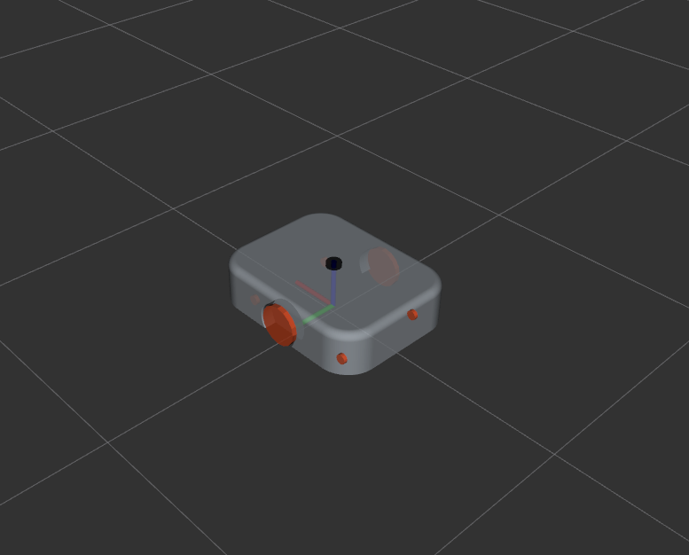

# TWR

    

## Sensors

| **Sensor** | **Quantity** | **Description** |
|--|--|--|
| **LiDAR**     | 1 |Light Detection and Ranging|
| **IMU**       | 1 |Inertial Measurement Unit|
| **Encoder**   | 2 |Wheel encoders for each side|

Get more detailed information about each sensor:

  - 
[LiDAR](./sensors/lidar.md)

  - 
[IMU](./sensors/imu.md)

  - 
[Encoders](./sensors/encoders.md)

