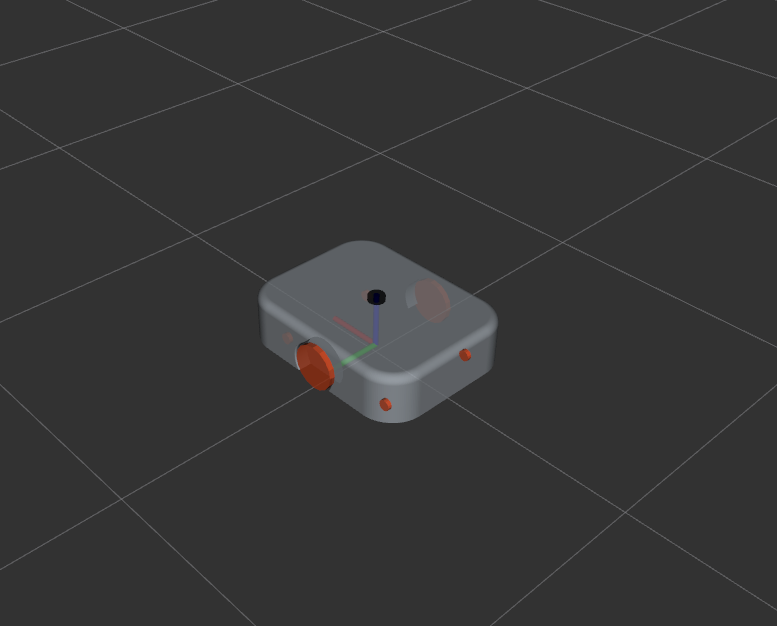

# TWR

<figure markdown="span">
  { width="600" }
</figure>
  
## Sensors

| **Sensor** | **Quantity** | **Description** |
|--|--|--|
| **LiDAR**     | 1 |Light Detection and Ranging|
| **IMU**       | 1 |Inertial Measurement Unit|
| **Encoder**   | 2 |Wheel encoders for each side|

Get more detailed information about each sensor type:

  [LiDAR](./sensors/lidar.md){ .md-button .md-button--primary }
  [IMU](./sensors/imu.md){ .md-button .md-button--primary }
  [Encoders](./sensors/encoders.md){ .md-button .md-button--primary }

