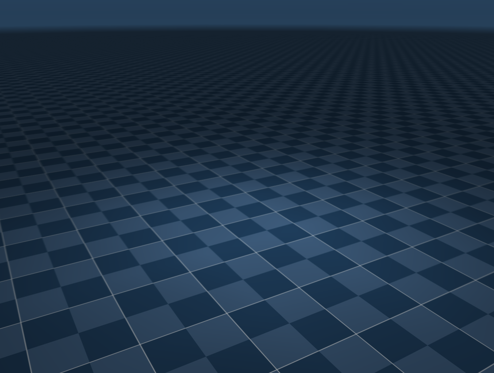

# MuJoCo

## Simulation Environments

Available simulation environments for MuJoCo.

### Empty

The empty simulation environment provides a blank MuJoCo world with no obstacles or objects. It is useful for testing basic robot functionality and control without any environmental interference. The corresponding MuJoCo XML world model file is located at `twr_sim/mujoco/worlds/empty.xml`.

    

